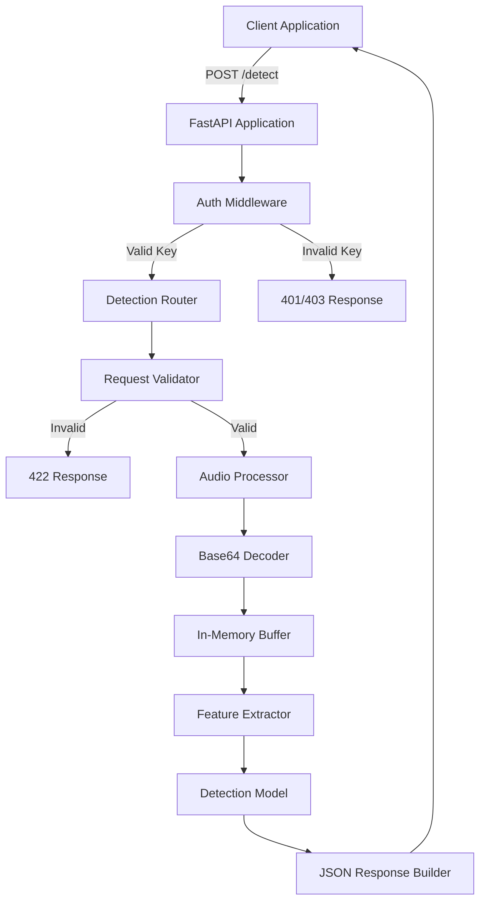

# Design Document: AI-Generated Voice Detection API

## Overview

The AI-Generated Voice Detection API is a FastAPI-based microservice that analyzes audio files to determine whether they contain AI-generated or human voices. The system accepts base64-encoded audio data via REST API, processes it through a feature extraction pipeline, and uses a pretrained machine learning model to classify the audio with confidence scores.

The architecture follows a layered approach with clear separation of concerns:
- **API Layer**: FastAPI endpoints and request/response handling
- **Authentication Layer**: Middleware for API key validation
- **Processing Layer**: Audio decoding and feature extraction
- **Model Layer**: ML model loading and inference
- **Configuration Layer**: Environment-based settings management

The system is designed for production deployment on Render.com with emphasis on security, error handling, and maintainability.

## Architecture

### High-Level Architecture



### Component Architecture

The system is organized into the following modules:

1. **main.py**: Application entry point, FastAPI app initialization
2. **api/routes.py**: Endpoint definitions and request handling
3. **api/middleware.py**: Authentication middleware
4. **api/schemas.py**: Pydantic models for request/response validation
5. **core/config.py**: Configuration management using environment variables
6. **services/audio_processor.py**: Audio decoding and memory management
7. **services/feature_extractor.py**: Librosa-based feature extraction
8. **services/model_service.py**: Model loading and inference
9. **utils/exceptions.py**: Custom exception classes
10. **utils/logger.py**: Logging configuration

## Components and Interfaces

### 1. API Layer

**FastAPI Application (main.py)**
```python
app = FastAPI(
    title="AI Voice Detection API",
    version="1.0.0",
    description="Detect AI-generated voices in audio files"
)

# Middleware registration
app.add_middleware(APIKeyMiddleware)

# Router registration
app.include_router(detection_router, prefix="/api/v1")

# Health check endpoint
@app.get("/health")
async def health_check() -> dict
```

**Detection Router (api/routes.py)**
```python
@router.post("/detect", response_model=DetectionResponse)
async def detect_voice(
    request: DetectionRequest,
    model_service: ModelService = Depends(get_model_service)
) -> DetectionResponse:
    """
    Processes audio and returns AI detection results.
    
    Raises:
        HTTPException: 400 for audio processing errors
        HTTPException: 500 for model inference errors
    """
```

### 2. Authentication Layer

**API Key Middleware (api/middleware.py)**
```python
class APIKeyMiddleware(BaseHTTPMiddleware):
    async def dispatch(request: Request, call_next) -> Response:
        """
        Validates x-api-key header against configured keys.
        
        Returns:
            Response: Continues to endpoint if valid
            
        Raises:
            HTTPException: 401 if key missing, 403 if invalid
        """
```

**Configuration (core/config.py)**
```python
class Settings(BaseSettings):
    api_keys: List[str]  # Loaded from environment
    model_name: str
    model_cache_dir: str
    log_level: str
    
    class Config:
        env_file = ".env"
```

### 3. Processing Layer

**Audio Processor (services/audio_processor.py)**
```python
class AudioProcessor:
    @staticmethod
    def decode_base64_audio(audio_base64: str) -> BytesIO:
        """
        Safely decodes base64 audio to in-memory buffer.
        
        Args:
            audio_base64: Base64-encoded audio string
            
        Returns:
            BytesIO: In-memory audio buffer
            
        Raises:
            AudioDecodingError: If decoding fails
        """
    
    @staticmethod
    def validate_audio_format(buffer: BytesIO, expected_format: str) -> bool:
        """
        Validates audio format matches expected type.
        """
```

**Feature Extractor (services/feature_extractor.py)**
```python
class FeatureExtractor:
    def __init__(self, sample_rate: int = 16000):
        self.sample_rate = sample_rate
    
    def extract_features(self, audio_buffer: BytesIO) -> np.ndarray:
        """
        Extracts audio features using librosa.
        
        Features extracted:
        - MFCC (Mel-frequency cepstral coefficients)
        - Spectral centroid
        - Zero crossing rate
        - Chroma features
        
        Args:
            audio_buffer: In-memory audio data
            
        Returns:
            np.ndarray: Feature vector for model input
            
        Raises:
            FeatureExtractionError: If extraction fails
        """
```

### 4. Model Layer

**Model Service (services/model_service.py)**
```python
class ModelService:
    def __init__(self, model_name: str, cache_dir: str):
        self.model_name = model_name
        self.cache_dir = cache_dir
        self.model = None
        self.processor = None
    
    def load_model(self) -> None:
        """
        Loads pretrained model from HuggingFace.
        
        Model: Uses a pretrained audio classification model
        (e.g., "facebook/wav2vec2-base" or similar deepfake detection model)
        """
    
    def predict(self, features: np.ndarray) -> Tuple[bool, float]:
        """
        Predicts if audio is AI-generated.
        
        Args:
            features: Extracted audio features
            
        Returns:
            Tuple[bool, float]: (is_ai_generated, confidence_score)
            
        Raises:
            ModelInferenceError: If prediction fails
        """
    
    def detect_language(self, audio_buffer: BytesIO) -> str:
        """
        Detects language from audio (optional enhancement).
        
        Returns:
            str: Detected language code
        """
```

## Data Models

### Request Schema

```python
class DetectionRequest(BaseModel):
    language: str = Field(
        ...,
        description="Expected language of the audio",
        example="en"
    )
    audio_format: str = Field(
        ...,
        description="Audio file format",
        pattern="^(mp3|wav|flac)$",
        example="mp3"
    )
    audio_base64: str = Field(
        ...,
        description="Base64-encoded audio data",
        min_length=1
    )
    
    @validator('audio_base64')
    def validate_base64(cls, v):
        """Validates base64 encoding format"""
        try:
            base64.b64decode(v, validate=True)
            return v
        except Exception:
            raise ValueError("Invalid base64 encoding")
```

### Response Schema

```python
class DetectionResponse(BaseModel):
    is_ai_generated: bool = Field(
        ...,
        description="Whether the voice is AI-generated"
    )
    confidence: float = Field(
        ...,
        ge=0.0,
        le=1.0,
        description="Confidence score of the prediction"
    )
    detected_language: str = Field(
        ...,
        description="Detected or provided language"
    )
    message: str = Field(
        ...,
        description="Human-readable result description"
    )
    
    class Config:
        schema_extra = {
            "example": {
                "is_ai_generated": True,
                "confidence": 0.87,
                "detected_language": "en",
                "message": "Voice detected as AI-generated with high confidence"
            }
        }
```

### Error Response Schema

```python
class ErrorResponse(BaseModel):
    error: str = Field(..., description="Error type")
    detail: str = Field(..., description="Error details")
    status_code: int = Field(..., description="HTTP status code")
```

## Correctness Properties

*A property is a characteristic or behavior that should hold true across all valid executions of a system—essentially, a formal statement about what the system should do. Properties serve as the bridge between human-readable specifications and machine-verifiable correctness guarantees.*


### Property Reflection

After analyzing all acceptance criteria, I've identified the following redundancies:
- Properties 1.4 and 6.1 both test response structure (can be combined)
- Properties 5.4 and 6.3 both test confidence bounds (duplicate)
- Properties 5.3 and 6.2 both test boolean output type (can be combined)

The following properties will be consolidated or removed to avoid redundancy while maintaining comprehensive coverage.

### Properties

**Property 1: Valid request acceptance**
*For any* valid JSON request body containing language, audio_format, and audio_base64 fields, the API should accept the request and process it without validation errors.
**Validates: Requirements 1.3**

**Property 2: Response structure completeness**
*For any* valid detection request, the API response should contain all required fields: is_ai_generated (boolean), confidence (float), detected_language (string), and message (string).
**Validates: Requirements 1.4, 6.1**

**Property 3: Authentication enforcement**
*For any* request without a valid x-api-key header, the Auth_Middleware should reject the request before reaching the endpoint.
**Validates: Requirements 2.1**

**Property 4: Valid authentication bypass**
*For any* request with a valid x-api-key header, the Auth_Middleware should allow the request to proceed to the endpoint handler.
**Validates: Requirements 2.4**

**Property 5: Required field validation**
*For any* request missing one or more required fields (language, audio_format, audio_base64), the API should reject the request with validation errors.
**Validates: Requirements 3.1**

**Property 6: Safe base64 decoding**
*For any* base64 string (valid or invalid), the Audio_Processor should handle decoding without causing system crashes or unhandled exceptions.
**Validates: Requirements 3.4**

**Property 7: Audio decoding round-trip**
*For any* valid audio binary data, encoding to base64 then decoding should produce equivalent binary data.
**Validates: Requirements 4.1**

**Property 8: Feature extraction consistency**
*For any* valid audio input, the Feature_Extractor should produce a feature vector suitable for model input without errors.
**Validates: Requirements 4.4**

**Property 9: Prediction completeness**
*For any* valid audio features, the Detection_Model should produce both a boolean classification and a confidence score.
**Validates: Requirements 5.2, 5.3**

**Property 10: Confidence bounds**
*For any* model prediction, the confidence score should be a float value between 0.0 and 1.0 inclusive.
**Validates: Requirements 5.4, 6.3**

**Property 11: Boolean classification type**
*For any* detection response, the is_ai_generated field should be a boolean value (true or false).
**Validates: Requirements 6.2**

**Property 12: Language field preservation**
*For any* valid request with a language field, the response detected_language field should contain a valid language string.
**Validates: Requirements 6.4**

**Property 13: Message field presence**
*For any* detection response, the message field should be present and contain a non-empty string.
**Validates: Requirements 6.5**

**Property 14: Error handling without crashes**
*For any* exception during request processing, the API should return an appropriate HTTP error status (4xx or 5xx) without crashing.
**Validates: Requirements 7.1**

**Property 15: Stack trace concealment**
*For any* error response, the response body should not contain Python stack traces or internal implementation details.
**Validates: Requirements 7.5**

**Property 16: Environment variable configuration**
*For any* environment variable set for API keys or model paths, the application should load and use those values correctly.
**Validates: Requirements 9.4**

## Error Handling

### Error Categories

1. **Authentication Errors (401/403)**
   - Missing API key: Return 401 with message "API key required"
   - Invalid API key: Return 403 with message "Invalid API key"

2. **Validation Errors (422)**
   - Missing required fields: Return field-specific error details
   - Invalid base64 encoding: Return "Invalid base64 encoding in audio_base64 field"
   - Invalid audio format: Return "Unsupported audio format"

3. **Processing Errors (400)**
   - Audio decoding failure: Return "Failed to decode audio data"
   - Corrupted audio file: Return "Audio file is corrupted or unreadable"
   - Feature extraction failure: Return "Failed to extract audio features"

4. **Server Errors (500)**
   - Model loading failure: Return "Model service unavailable"
   - Model inference failure: Return "Prediction failed, please try again"
   - Unexpected exceptions: Return "Internal server error"

### Error Response Format

All errors follow a consistent JSON structure:

```python
{
    "error": "ErrorType",
    "detail": "Human-readable error description",
    "status_code": 400
}
```

### Exception Hierarchy

```python
class APIException(Exception):
    """Base exception for all API errors"""
    status_code: int
    detail: str

class AuthenticationError(APIException):
    status_code = 401

class AuthorizationError(APIException):
    status_code = 403

class AudioDecodingError(APIException):
    status_code = 400

class FeatureExtractionError(APIException):
    status_code = 400

class ModelInferenceError(APIException):
    status_code = 500
```

### Error Handling Strategy

1. **Try-Catch Blocks**: Wrap all processing steps in try-catch blocks
2. **Custom Exceptions**: Raise custom exceptions with appropriate status codes
3. **Exception Handler**: Global exception handler converts exceptions to JSON responses
4. **Logging**: Log all errors with full stack traces internally
5. **Client Response**: Return sanitized error messages without exposing internals

## Testing Strategy

### Dual Testing Approach

This project requires both unit tests and property-based tests to ensure comprehensive coverage:

- **Unit tests**: Verify specific examples, edge cases, and error conditions
- **Property tests**: Verify universal properties across all inputs

Both testing approaches are complementary and necessary. Unit tests catch concrete bugs in specific scenarios, while property tests verify general correctness across a wide range of inputs.

### Property-Based Testing

**Framework**: We will use **Hypothesis** for Python property-based testing.

**Configuration**:
- Each property test must run a minimum of 100 iterations
- Each test must be tagged with a comment referencing the design property
- Tag format: `# Feature: ai-voice-detection-api, Property {number}: {property_text}`

**Property Test Examples**:

```python
from hypothesis import given, strategies as st
import hypothesis

# Feature: ai-voice-detection-api, Property 1: Valid request acceptance
@given(
    language=st.text(min_size=2, max_size=5),
    audio_format=st.sampled_from(["mp3", "wav", "flac"]),
    audio_base64=st.binary().map(lambda b: base64.b64encode(b).decode())
)
@hypothesis.settings(max_examples=100)
def test_valid_request_acceptance(language, audio_format, audio_base64):
    """Test that valid requests are accepted"""
    request = {
        "language": language,
        "audio_format": audio_format,
        "audio_base64": audio_base64
    }
    response = client.post("/detect", json=request, headers={"x-api-key": VALID_KEY})
    assert response.status_code in [200, 400, 500]  # Not 422 validation error

# Feature: ai-voice-detection-api, Property 10: Confidence bounds
@given(audio_data=st.binary(min_size=1000, max_size=10000))
@hypothesis.settings(max_examples=100)
def test_confidence_bounds(audio_data):
    """Test that confidence scores are always between 0 and 1"""
    audio_base64 = base64.b64encode(audio_data).decode()
    request = {
        "language": "en",
        "audio_format": "mp3",
        "audio_base64": audio_base64
    }
    response = client.post("/detect", json=request, headers={"x-api-key": VALID_KEY})
    if response.status_code == 200:
        data = response.json()
        assert 0.0 <= data["confidence"] <= 1.0
```

### Unit Testing

**Framework**: pytest

**Test Categories**:

1. **Authentication Tests**
   - Test missing API key returns 401
   - Test invalid API key returns 403
   - Test valid API key allows access

2. **Validation Tests**
   - Test missing required fields returns 422
   - Test invalid base64 returns 422
   - Test invalid audio format returns 422

3. **Audio Processing Tests**
   - Test successful base64 decoding
   - Test corrupted base64 handling
   - Test feature extraction with valid audio

4. **Model Tests**
   - Test model loading
   - Test prediction with valid features
   - Test prediction output types

5. **Integration Tests**
   - Test complete detection flow with valid audio
   - Test error handling for invalid audio
   - Test response format compliance

### Test Organization

```
tests/
├── __init__.py
├── conftest.py              # Pytest fixtures
├── test_authentication.py   # Auth middleware tests
├── test_validation.py       # Request validation tests
├── test_audio_processor.py  # Audio processing unit tests
├── test_feature_extractor.py # Feature extraction tests
├── test_model_service.py    # Model inference tests
├── test_api_integration.py  # End-to-end API tests
└── test_properties.py       # Property-based tests
```

### Testing Best Practices

1. **Avoid over-testing**: Focus on core functionality and important edge cases
2. **Use real data**: Don't mock the model or audio processing unless necessary
3. **Test error paths**: Ensure all error conditions are properly handled
4. **Verify response formats**: Check that all responses match schemas
5. **Test with various audio formats**: Use different audio types and sizes
6. **Performance considerations**: Test with realistic audio file sizes

## Deployment Configuration

### Environment Variables

```bash
# Required
API_KEYS=key1,key2,key3
MODEL_NAME=facebook/wav2vec2-base
MODEL_CACHE_DIR=/tmp/models

# Optional
LOG_LEVEL=INFO
PORT=8000
HOST=0.0.0.0
```

### Render.com Configuration

**render.yaml**:
```yaml
services:
  - type: web
    name: ai-voice-detection-api
    env: python
    buildCommand: pip install -r requirements.txt
    startCommand: uvicorn main:app --host 0.0.0.0 --port $PORT
    envVars:
      - key: PYTHON_VERSION
        value: 3.10.0
      - key: API_KEYS
        sync: false
      - key: MODEL_NAME
        value: facebook/wav2vec2-base
      - key: MODEL_CACHE_DIR
        value: /tmp/models
    healthCheckPath: /health
```

### Docker Support (Optional)

```dockerfile
FROM python:3.10-slim

WORKDIR /app

COPY requirements.txt .
RUN pip install --no-cache-dir -r requirements.txt

COPY . .

EXPOSE 8000

CMD ["uvicorn", "main:app", "--host", "0.0.0.0", "--port", "8000"]
```

### Health Check Endpoint

```python
@app.get("/health")
async def health_check():
    """
    Health check endpoint for monitoring.
    
    Returns:
        dict: Status and model availability
    """
    return {
        "status": "healthy",
        "model_loaded": model_service.model is not None,
        "timestamp": datetime.utcnow().isoformat()
    }
```

## Performance Considerations

1. **Model Loading**: Load model once at startup, not per request
2. **Memory Management**: Use BytesIO for in-memory audio processing
3. **Feature Caching**: Consider caching extracted features for repeated requests
4. **Async Processing**: Use FastAPI's async capabilities for I/O operations
5. **Request Timeouts**: Set reasonable timeouts for model inference
6. **Rate Limiting**: Consider adding rate limiting for production use

## Security Considerations

1. **API Key Storage**: Store API keys in environment variables, never in code
2. **Input Validation**: Validate all inputs before processing
3. **Base64 Validation**: Verify base64 encoding before decoding
4. **File Size Limits**: Limit maximum audio file size to prevent DoS
5. **Error Messages**: Don't expose internal details in error messages
6. **HTTPS**: Use HTTPS in production (handled by Render.com)
7. **CORS**: Configure CORS appropriately for your use case
